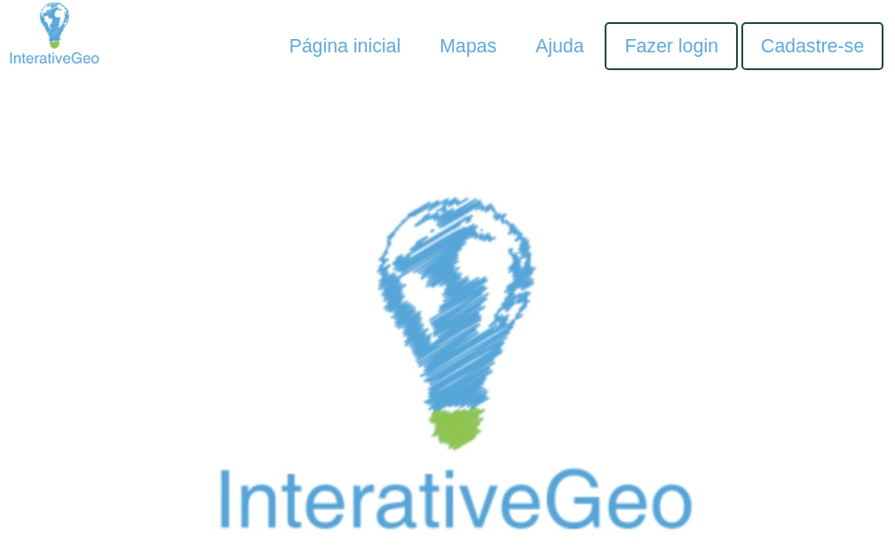

# Atlas Digital InterativeGeo - UTFPR

Este atlas foi desenvolvido como um trabalho de TCC, com autoria do acadêmico Ricardo de Souza, na UTFPR, Francisco Beltrão, so a orientação do professor [Michel Albonico](https://michelalbonico.github.io/) e co-orientação do professor Fernando Cézar Manosso.

# Configurando o Ambiente

Toda a aplicação está contida em uma imagem Docker. Portanto, antes de iniciar, proceda com [esta](https://docs.docker.com/engine/install/ubuntu/) instalação.

# Instalando a Aplicação

Para instalar o Atlas Digital InterativeGeo basta executa o arquivo <i>run.sh</i> contido neste projeto.

```
$ chmod +x run.sh
$ bash run.sh
```

Todo o processo é automatizado.

# Acessando a Aplicação

Para acessar a aplicação, digite em seu navegador a URL <i>http://localhost:8082</i>.

Você deverá visualizar a seguinte tela:


